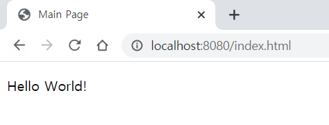
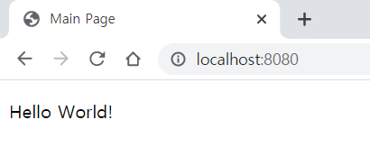
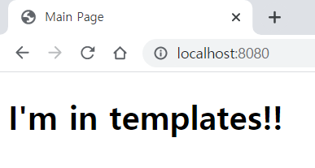
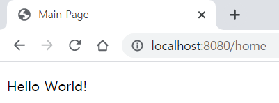

## 4. static & templates, Controller, Thymeleaf

spring boot에서 프로젝트를 생성하면 기본적으로 `src/main/resources`에 두개의 directory가 있다. `static`과 `templates`

* `static` css나 js등 정적 컨텐츠를 담는다.
* `templates`에는 thymeleaf관련 컨텐츠를 담는다.
* [공식 문서 참고](http://docs.spring.io/spring-boot/docs/current/reference/html/boot-features-developing-web-applications.html#boot-features-spring-mvc-static-content)

`static ` directory 기본 설정에서 url이 없으면 index.html으로 인식한다. 그래서 `localhost:8080`이나 `localhost:8080/index.html`둘 다 같은 page를 반환한다.

* 
* 
  * 둘 다 같은 page임!


정적 페이지가 아닌 동적 페이지를 출력하기 위해서는 `templates`에서 작성해야한다. 그리고 spring boot에서 `templates`에 있는 html파일을 출력하기 위해 Controller가 필요하다.

* ```java
  // HomeController
  
  @Controller
  public class HomeController {
    
    public String home() {
      return "index";
    }
  }
  ```

* ```html
  <!-- src/resources/templates/index.html -->
  <!DOCTYPE html>
  <html lang="en">
  <head>
    <meta charset="UTF-8">
    <title>Main Page</title>
  </head>
  <body>
  <h1> I'm in templates!!</h1>
  </body>
  </html>
  ```

* 

사용자(browser)에서 요청한 주소 (`localhost:8080/{url}`) 👉 Spring Boot의 Controller에서 `{url}`에 매핑되는 메서드를 찾는다. 👉 메서드에서 반환하는 String이 `templates`에 있는 html파일명 👉 해당 파일을 사용자가 볼 수 있게 전달한다.

* ```java
  // HomeController
  @Controller
  public class HomeController {
  
    @GetMapping("/home")
    public String home() {
      return "index";
    }
  }
  ```

  

* 

  * `localhost:8080/home`의 `home`에 매핑되는 메서드 `String home()` 👉 `home()`이 반환하는 `index`를 `src/resources/templates`에서 찾아 사용자에게 보여준다.

`static`과 `templates`차이를 하나 더 보면 `static`의 경우 url에 `.html`까지 붙여야하지만 `templates`은 기본적으로 html에 매핑되기때문에 붙이지않는다.

