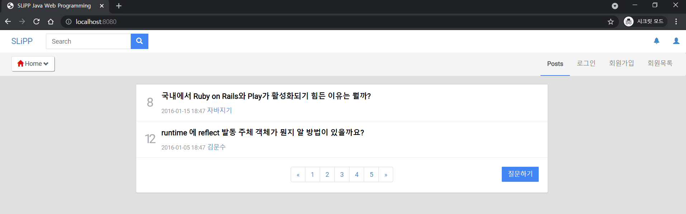
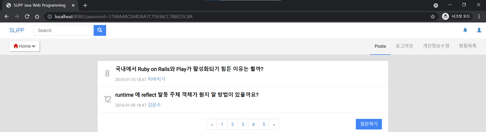

# 9. 로그인 기능 구현

이제 대략적인 개발 패턴(?)이 익숙해졌다. 우선 로그인 form 페이지가 필요하니까 `static`에 있던 `login.html`을 `templates`로 옮기고 수정한다.

* ```html
  <!-- src/resources/templates/users/login.html -->
  <!DOCTYPE html>
  <html lang="kr" xmlns:th="http://www.thymeleaf.org">
  <head th:replace="include/header :: header"></head>
  <body>
  <div th:replace="include/navigation :: navigation"></div>
  <div class="container" id="main">
    <div class="col-md-6 col-md-offset-3">
      <div class="panel panel-default content-main">
        <form name="question" method="post" action="/users/login">
          <div class="form-group">
            <label for="userId">사용자 아이디</label>
            <input class="form-control" id="userId" name="userId" placeholder="User ID">
          </div>
          <div class="form-group">
            <label for="password">비밀번호</label>
            <input type="password" class="form-control" id="password" name="password"
                   placeholder="Password">
          </div>
          <button type="submit" class="btn btn-success clearfix pull-right">로그인</button>
          <div class="clearfix"/>
        </form>
      </div>
    </div>
  </div>
  
  <div th:replace="include/footer ::footer"></div>
  </body>
  </html>
  ```

그리고 `navigation.html`의 로그인 메뉴 url도 수정해준다.

* ```html
  <!-- src/resources/templates/include/navigation.html -->
  <!-- 윗부분 생략 -->
  
        <div class="collapse navbar-collapse" id="navbar-collapse2">
          <ul class="nav navbar-nav navbar-right">
            <li class="active"><a href="/">Posts</a></li>
            <li><a href="/users/login" role="button">로그인</a></li>
            <li><a href="/users/signUpForm" role="button">회원가입</a></li>
            <li><a href="/" role="button">로그아웃</a></li>
            <li><a href="/" role="button">개인정보수정</a></li>
            <li><a href="/users" role="button">회원목록</a></li>
          </ul>
        </div>
      </div>
    </div>
  </div>
  </html>
  ```

  * 로그인 메뉴 url을`/users/login`으로 수정

그럼 당연히 `UserController.java`에 로그인 메뉴 url에 매핑하는 메서드를 만들어야한다.

* ```java
  // src/main/java/com/app/controller/UserController.java
  @Controller
  @RequestMapping("/users")
  public class UserController {
  
    @Autowired
    private UserService userService;
  
    @GetMapping("/login")
    public String loginForm() {
      return "users/login";
    }
  
    // 아래 생략
  }
  ```

여기까지가 로그인 form 페이지 기능 구현이다. `login.html`을 보면, 사용자 아이디와, 패스워드를 입력하고 제출하면 `/users/login` url로 POST 방식으로 요청한다. 그럼 이 요청에 대한 메서드를 또 만들어 줘야한다.

* ```java
  @Controller
  @RequestMapping("/users")
  public class UserController {
  
    @Autowired
    private UserService userService;
  
    @GetMapping("/login")
    public String loginForm() {
      return "users/login";
    }
  
    @PostMapping("/login")
    public String login(String userId, String password, HttpSession session) {
      User user = userService.login(userId, password);
      if(user == null) {
        return "users/loginFailed";
      }
  
      session.setAttribute("user", user);
      return "redirect:/";
    }
  
    // 아래 생략
  }
  
  ```

  * `UserService`의 `login()`메서드를 호출해서 `login.html`에서 입력한 사용자 아이디와 패스워드를 확인한다. 해당 user가 없다면 `users/loginFaild.html`으로, 해당 user가 있다면 Session에 추가하고 main 페이지로 redirection 한다.

`login.html`에서 입력한 사용자 아이디와 패스워드를 데이터 베이스에서 확인한다. JPA를 이용해서 입력한 아이디를 찾고 아이디가 일치하면 패스워드가 같은지 확인한다.  아이디나 패스워드가 일치하지 않는다면 null을 리턴하도록 한다. `login.html`에서 입력한 사용자 아이디와 패스워드가 일치하지 않으면 `loginFailed.html`로 이동하도록 했다. `loginFailed.html`은 `login.html`와 같지만 로그인에 실패했다는 error 메세지만 더 출력하도록 했다. 

* ```java
  @Service
  public class UserService {
  
    // 생략
  
    public User login(String userId, String password) {
      User user = userRepository.findByUserId(userId);
      if (user == null) {
        return null;
      }
      if (!password.equals(user.getPassword())) {
        return null;
      }
  
      return user;
    }
  }
  ```

  * `findByUserId()`는 회원 정보 상세 조회 기능때 만든 메서드이다.

메인 페이지를 보면 로그인을 했을 때, 로그인을 하지 않았을 때 '회원가입', '로그인', '로그아웃', '개인정보수정' 메뉴가 항상 있다. 하지만 보통 웹사이트를 보면, 로그인을 했을 때 '회원가입', '로그인' 메뉴는 없으며 로그인을 하지 않았을 때 '로그아웃', '개인정보수정' 메뉴는 존재하지 않는다. 그래서 이 부분을 Session이 있을 때와 없을 때로 보여줄 수 있도록 thymeleaf를 이용했다.

* ```html
  <!-- src/resources/templates/include/navigation.html -->
  <!-- 위 생략 -->
        <div class="collapse navbar-collapse" id="navbar-collapse2">
          <ul class="nav navbar-nav navbar-right">
            <li class="active"><a href="/">Posts</a></li>
            <li th:if="${session.isEmpty()}"><a href="/users/login" role="button">로그인</a></li>
            <li th:if="${session.isEmpty()}"><a href="/users/signUpForm" role="button">회원가입</a></li>
            <li th:if="${!session.isEmpty()}"><a href="/" role="button">로그아웃</a></li>
            <li th:if="${!session.isEmpty()}"><a href="/" role="button">개인정보수정</a></li>
            <li><a href="/users" role="button">회원목록</a></li>
          </ul>
        </div>
      </div>
    </div>
  </div>
  </html>
  ```

* 

  * 로그인 하지 않았을 때

* 

  * 로그인 했을 때, Session이 url에 남아있다.


