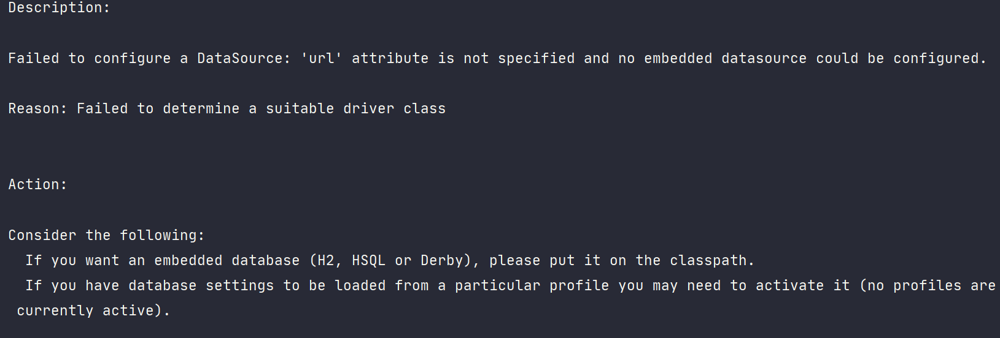
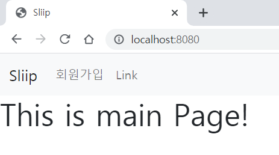

# 정리

## 1. 개발 환경
   * Java8
   * IntelliJ 2020.01
   * Spring Boot 2.5.0
   * MySQL
   * Thymeleaf

## 2. MySql 연동

프로젝트 생성 후 실행하면 다음과 같은 에러 메시지가 나온다.

 * 

H2 데이터베이스를 사용할 경우 자동으로 설정을 잡아주기 때문에 별도로 설정을 입력할 필요가 없지만 MySQL을 사용할 경우  `src/main/resources`의 `application.properties` 또는 `application.yml` 에 설정을 입력해야한다.

* ``` yaml
  spring:
  	datasource:
  		driver-class-name: com.mysql.cj.jdbc.Driver
  		url: jdbc:mysql://localhost:3306/{db_name}?serverTimezone=UTC&characterEncoding=UTF-8
  		username: {db_user_name}
  		password: {db_user_password}
  ```

  * driver-class-name : `com.mysql.jdbc.Driver`와 `com.mysql.cj.jdbc.Driver`가 있는데 전자는 deprecated라고 해서 후자를 사용
  * url
    * {db_name}은 mysql에 생성한 database 이름을 작성
    * serverTimezone=UTC를 작성해야 에러가 발생하지 않는다.
  * username / password : mysql 계정이름과 비밀번호를 작성한다.

설정 입력후 다시 실행을 하면 정상적으로 실행이된다.


## 3. Hello World

`src/main/resources/static`에 `index.html`을 생성한다.

* ```html
  <!DOCTYPE html>
  <html lang="en">
  <head>
    <meta charset="UTF-8">
    <title>Main Page</title>
  </head>
  <body>
  <p> Hello World!</p>
  </body>
  </html>
  ```

실행하고 `https://localhost:8080`에 접속하면 다음과 같이 `index.html`페이지가 실행된다.

* 


## 4. static & templates, Controller, Thymeleaf

spring boot에서 프로젝트를 생성하면 기본적으로 `src/main/resources`에 두개의 directory가 있다. `static`과 `templates`

* `static` css나 js등 정적 컨텐츠를 담는다.
* `templates`에는 thymeleaf관련 컨텐츠를 담는다.
* [공식 문서 참고](http://docs.spring.io/spring-boot/docs/current/reference/html/boot-features-developing-web-applications.html#boot-features-spring-mvc-static-content)

`static ` directory 기본 설정에서 url이 없으면 index.html으로 인식한다. 그래서 `localhost:8080`이나 `localhost:8080/index.html`둘 다 같은 page를 반환한다.

* 
* 
  * 둘 다 같은 page임!


정적 페이지가 아닌 동적 페이지를 출력하기 위해서는 `templates`에서 작성해야한다. 그리고 spring boot에서 `templates`에 있는 html파일을 출력하기 위해 Controller가 필요하다.

* ```java
  // HomeController
  
  @Controller
  public class HomeController {
    
    public String home() {
      return "index";
    }
  }
  ```

* ```html
  <!-- src/resources/templates/index.html -->
  <!DOCTYPE html>
  <html lang="en">
  <head>
    <meta charset="UTF-8">
    <title>Main Page</title>
  </head>
  <body>
  <h1> I'm in templates!!</h1>
  </body>
  </html>
  ```

* 

사용자(browser)에서 요청한 주소 (`localhost:8080/{url}`) 👉 Spring Boot의 Controller에서 `{url}`에 매핑되는 메서드를 찾는다. 👉 메서드에서 반환하는 String이 `templates`에 있는 html파일명 👉 해당 파일을 사용자가 볼 수 있게 전달한다.

* ```java
  // HomeController
  @Controller
  public class HomeController {
  
    @GetMapping("/home")
    public String home() {
      return "index";
    }
  }
  ```

  

* 

  * `localhost:8080/home`의 `home`에 매핑되는 메서드 `String home()` 👉 `home()`이 반환하는 `index`를 `src/resources/templates`에서 찾아 사용자에게 보여준다.

`static`과 `templates`차이를 하나 더 보면 `static`의 경우 url에 `.html`까지 붙여야하지만 `templates`은 기본적으로 html에 매핑되기때문에 붙이지않는다.


# 5 회원 가입 페이지 만들기

view 처리를 하는 방법을 알아보고 내가 아는 수준에서는

1. MVC패턴으로 back end와 front end를 같이 처리
2. REST API를 통해 사용자로부터의 요청을 server에서 처리 후 client로 JSON형태로 보냄, client에서 JSON을 이용해서 View 처리 후 사용자에게 보여줌

이정도이다. 후자의 방법 중 요즘은 React를 많이 쓴다고 한다. 우선은 1번 방법으로 공부 한 후에 2번방법도 시도해볼것.


메인 페이지에 Navigation을 깔고, Navigation에 회원가입 링크를 만들어 회원 가입 form 페이지로 이동할 것이다. 그래서 먼저 main 페이지를 수정했다.

- ```html
  <!-- resources/templates/index.html -->
  <!doctype html>
  <html lang="en">
  <head>
    <meta charset="utf-8">
    <meta name="viewport" content="width=device-width, initial-scale=1">
    <link href="https://cdn.jsdelivr.net/npm/bootstrap@5.0.1/dist/css/bootstrap.min.css"
          rel="stylesheet"
          integrity="sha384-+0n0xVW2eSR5OomGNYDnhzAbDsOXxcvSN1TPprVMTNDbiYZCxYbOOl7+AMvyTG2x"
          crossorigin="anonymous">
    <title>Sliip</title>
  </head>
  <body>
  <nav class="navbar navbar-expand-lg navbar-light bg-light">
    <div class="container-fluid">
      <a class="navbar-brand" href="">Sliip</a>
      <button class="navbar-toggler" type="button" data-bs-toggle="collapse"
              data-bs-target="#navbarSupportedContent" aria-controls="navbarSupportedContent"
              aria-expanded="false" aria-label="Toggle navigation">
        <span class="navbar-toggler-icon"></span>
      </button>
      <div class="collapse navbar-collapse" id="navbarSupportedContent">
        <ul class="navbar-nav me-auto mb-2 mb-lg-0">
          <li class="nav-item">
            <!-- 회원가입 페이지 링크 추가-->
            <a class="nav-link" href="/signUpForm">회원가입</a>
          </li>
          <li class="nav-item">
            <a class="nav-link" href="">Link</a>
          </li>
        </ul>
      </div>
    </div>
  </nav>
  <h1>This is main Page!</h1>
  <script src="https://cdn.jsdelivr.net/npm/bootstrap@5.0.1/dist/js/bootstrap.bundle.min.js"
          integrity="sha384-gtEjrD/SeCtmISkJkNUaaKMoLD0//ElJ19smozuHV6z3Iehds+3Ulb9Bn9Plx0x4"
          crossorigin="anonymous"></script>
  </body>
  </html>
  ```

- 
  - Navbar 등은 bootstrap을 참고했다.

메인 페이지의 Navigation에서 `회원가입`을 누르면 회원 가입 페이지로 이동하도록 했다. 그러기 위해서 index.html에서 a 태그를 통해 `/signUpForm`을 요청한다. 그러나 Controller에 해당 url을 매핑해줄 메서드가 존재하지 않기 때문에 누르면 오류 페이지로 이동한다.

* 
  * url을 보면 `localhost:8080/signUpForm`은 잘 나왔지만 매핑되는 페이지가 없어 에러페이지가 출력됨

이제 `/signUpForm`을 매핑해주는 메서드를 Controller에서 생성한다.

* ```java
  // HomeController
  @Controller
  public class HomeController {
  
    @GetMapping("/signUpForm")
    public String signUpForm() {
      return "signUpForm";
    }
  }
  ```

* ```html
  <!-- resources/templates/signUpForm.html -->
  <!doctype html>
  <html lang="en">
  <head>
    <meta charset="utf-8">
    <meta name="viewport" content="width=device-width, initial-scale=1">
    <link href="https://cdn.jsdelivr.net/npm/bootstrap@5.0.1/dist/css/bootstrap.min.css"
          rel="stylesheet"
          integrity="sha384-+0n0xVW2eSR5OomGNYDnhzAbDsOXxcvSN1TPprVMTNDbiYZCxYbOOl7+AMvyTG2x"
          crossorigin="anonymous">
    <title>Sliip</title>
  </head>
  <body>
  <nav class="navbar navbar-expand-lg navbar-light bg-light">
    <div class="container-fluid">
      <a class="navbar-brand" href="">Sliip</a>
      <button class="navbar-toggler" type="button" data-bs-toggle="collapse"
              data-bs-target="#navbarSupportedContent" aria-controls="navbarSupportedContent"
              aria-expanded="false" aria-label="Toggle navigation">
        <span class="navbar-toggler-icon"></span>
      </button>
      <div class="collapse navbar-collapse" id="navbarSupportedContent">
        <ul class="navbar-nav me-auto mb-2 mb-lg-0">
          <li class="nav-item">
            <a class="nav-link" href="/signUpForm">회원가입</a>
          </li>
          <li class="nav-item">
            <a class="nav-link" href="">Link</a>
          </li>
        </ul>
      </div>
    </div>
  </nav>
  <h1>회원 가입 페이지</h1>
  <div class="container">
    <form method="post" action="/createUser">
      <div class="mb-3">
        <label for="sign-up-form-userId" class="form-label">사용자 아이디</label>
        <input type="text" class="form-control" id="sign-up-form-userId" name="userId">
      </div>
      <div class="mb-3">
        <label for="sign-up-form-password" class="form-label">Password</label>
        <input type="password" class="form-control" id="sign-up-form-password" name="password">
      </div>
      <div class="mb-3">
        <label for="sign-up-form-name" class="form-label">이름</label>
        <input type="password" class="form-control" id="sign-up-form-name" name="name">
      </div>
      <div class="mb-3">
        <label for="sign-up-form-email" class="form-label">이메일</label>
        <input type="password" class="form-control" id="sign-up-form-email" name="email">
      </div>
      <button type="submit" class="btn btn-primary">Submit</button>
    </form>
    <script src="https://cdn.jsdelivr.net/npm/bootstrap@5.0.1/dist/js/bootstrap.bundle.min.js"
            integrity="sha384-gtEjrD/SeCtmISkJkNUaaKMoLD0//ElJ19smozuHV6z3Iehds+3Ulb9Bn9Plx0x4"
            crossorigin="anonymous"></script>
  </div>
  </body>
  </html>
  ```

  * 이때 Controller의 매핑되는 메서드의 return String이 resources/templates에 있는 html파일 이름과 같아야하고, `@GetMapping`어노테이션의 value와 요청하는 url과 같아야한다. 
