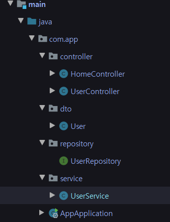

# 7. New templates으로 변경


front부분을 직접 만들기 어려워서 그냥 가져다 쓰는것으로 변경

static, templates resource url : https://github.com/slipp/web-application-server/

변경된 템플릿에서 내가 작성한 Controller의 메서드와 url 매핑

* ```java
  // src/main/java/com/app/UserController
  @Controller
  public class UserController {
  
    @Autowired
    private UserService userService;
  
    @GetMapping("/signUpForm")
    public String signUpForm() {
      return "signUpForm";
    }
  
    @PostMapping("/create")
    public String create(User user) {
      userService.create(user);
      return "redirect:";
    }
  }
  ```

  * 회원 가입 후 main page로 redirect하도록 변경

* ```html
  <!-- src/resources/index.html -->
  <!-- 윗부분 생략 -->
  <div class="navbar navbar-default" id="subnav">
      <div class="col-md-12">
          <div class="navbar-header">
              <!-- 생략 -->
          <div class="collapse navbar-collapse" id="navbar-collapse2">
              <ul class="nav navbar-nav navbar-right">
                  <li class="active"><a href="">Posts</a></li>
                  <li><a href="user/login.html" role="button">로그인</a></li>
                  <li><a href="/signUpForm" role="button">회원가입</a></li>
                  <li><a href="#" role="button">로그아웃</a></li>
                  <li><a href="#" role="button">개인정보수정</a></li>
              </ul>
          </div>
      </div>
  </div>
  <!-- 밑부분 생략 -->
  ```

  * 회원가입 기능만 구현했기 때문에 회원가입 url만 변경해준다. (signUpForm)

* ```html
  <!-- src/resources/signUpForm.html -->
  <!-- 윗부분 생략 -->
  <div class="container" id="main">
     <div class="col-md-6 col-md-offset-3">
        <div class="panel panel-default content-main">
            <form name="question" method="post" action="/create">
                <div class="form-group">
                    <label for="userId">사용자 아이디</label>
                    <input class="form-control" id="userId" name="userId" placeholder="User ID">
                </div>
                <div class="form-group">
                    <label for="password">비밀번호</label>
                    <input type="password" class="form-control" id="password" name="password" placeholder="Password">
                </div>
                <div class="form-group">
                    <label for="name">이름</label>
                    <input class="form-control" id="name" name="name" placeholder="Name">
                </div>
                <div class="form-group">
                    <label for="email">이메일</label>
                    <input type="email" class="form-control" id="email" name="email" placeholder="Email">
                </div>
                <button type="submit" class="btn btn-success clearfix pull-right">회원가입</button>
                <div class="clearfix" />
            </form>
          </div>
      </div>
  </div>
  <!-- 밑부분 생략-->
  ```

  * form method를 get -> post로 바꾸고 url도 /create로 바꿨다.

`UserController`에서 상위 url `/users`를 추가하고 url들을 조금씩 수정했다.

* ```java
  // src/main/java/com/app/controller/UserController.java
  @Controller
  @RequestMapping("/users")
  public class UserController {
  
    @Autowired
    private UserService userService;
  
    @GetMapping("/signUpForm")
    public String signUpForm() {
      return "signUpForm";
    }
  
    @PostMapping("")
    public String create(User user) {
      userService.create(user);
      return "redirect:";
    }
  }
  ```

  * `@RequestMapping`으로 상위 url `/users`를 추가함, 그에 따라 html파일들 url도 수정

자바 클래스 package를 Controller, DTO, Repository, Service로 분리했다.

* 

html 파일들에 header, navigation, footer들이 중복돼서 따로 분리 후 include했다.

* ```html
  <!-- src/resources/include/header.html -->
  <!DOCTYPE html>
  <html lang="kr" xmlns:th="http://www.thymeleaf.org">
  <head th:fragment="header">
    <meta http-equiv="content-type" content="text/html; charset=UTF-8">
    <meta charset="utf-8">
    <title>SLiPP Java Web Programming</title>
    <meta name="viewport" content="width=device-width, initial-scale=1, maximum-scale=1">
    <link th:href="@{/css/bootstrap.min.css}" rel="stylesheet">
    <!--[if lt IE 9]>
    <script src="//html5shim.googlecode.com/svn/trunk/html5.js"></script>
    <![endif]-->
    <link th:href="@{/css/styles.css}" rel="stylesheet">
  </head>
  <body>
  
  </body>
  </html>
  ```
  * link는 thymeleaf 사용

* ```html
  <!-- src/resources/include/navigation.html -->
  <!DOCTYPE html>
  <html lang="kr" xmlns:th="http://www.thymeleaf.org">
  <div th:fragment="navigation">
    <nav class="navbar navbar-fixed-top header">
      <div class="col-md-12">
        <div class="navbar-header">
  
          <a href="index.html" class="navbar-brand">SLiPP</a>
          <button type="button" class="navbar-toggle" data-toggle="collapse"
                  data-target="#navbar-collapse1">
            <i class="glyphicon glyphicon-search"></i>
          </button>
  
        </div>
        <div class="collapse navbar-collapse" id="navbar-collapse1">
          <form class="navbar-form pull-left">
            <div class="input-group" style="max-width:470px;">
              <input type="text" class="form-control" placeholder="Search" name="srch-term"
                     id="srch-term">
              <div class="input-group-btn">
                <button class="btn btn-default btn-primary" type="submit"><i
                    class="glyphicon glyphicon-search"></i></button>
              </div>
            </div>
          </form>
          <ul class="nav navbar-nav navbar-right">
            <li>
              <a href="#" class="dropdown-toggle" data-toggle="dropdown"><i
                  class="glyphicon glyphicon-bell"></i></a>
              <ul class="dropdown-menu">
                <li><a href="https://slipp.net" target="_blank">SLiPP</a></li>
                <li><a href="https://facebook.com" target="_blank">Facebook</a></li>
              </ul>
            </li>
            <li><a href="../static/user/list.html"><i class="glyphicon glyphicon-user"></i></a></li>
          </ul>
        </div>
      </div>
    </nav>
    <div class="navbar navbar-default" id="subnav">
      <div class="col-md-12">
        <div class="navbar-header">
          <a href="#" style="margin-left:15px;"
             class="navbar-btn btn btn-default btn-plus dropdown-toggle" data-toggle="dropdown"><i
              class="glyphicon glyphicon-home" style="color:#dd1111;"></i> Home <small><i
              class="glyphicon glyphicon-chevron-down"></i></small></a>
          <ul class="nav dropdown-menu">
            <li><a href="../static/user/profile.html"><i class="glyphicon glyphicon-user"
                                                         style="color:#1111dd;"></i> Profile</a></li>
            <li class="nav-divider"></li>
            <li><a href="#"><i class="glyphicon glyphicon-cog" style="color:#dd1111;"></i>
              Settings</a>
            </li>
          </ul>
  
          <button type="button" class="navbar-toggle" data-toggle="collapse"
                  data-target="#navbar-collapse2">
            <span class="sr-only">Toggle navigation</span>
            <span class="icon-bar"></span>
            <span class="icon-bar"></span>
            <span class="icon-bar"></span>
          </button>
        </div>
        <div class="collapse navbar-collapse" id="navbar-collapse2">
          <ul class="nav navbar-nav navbar-right">
            <li class="active"><a href="">Posts</a></li>
            <li><a href="../static/user/login.html" role="button">로그인</a></li>
            <li><a href="/users/signUpForm" role="button">회원가입</a></li>
            <li><a href="#" role="button">로그아웃</a></li>
            <li><a href="#" role="button">개인정보수정</a></li>
          </ul>
        </div>
      </div>
    </div>
  </div>
  </html>
  ```

  * `UserController`의 상위 url `/users`를 추가했기 때문에 회원가입 url도 `/users/signUpForm`으로 수정

* ```html
  <!DOCTYPE html>
  <html lang="kr" xmlns:th="http://www.thymeleaf.org">
  <body>
  <div th:fragment="footer">
    <script th:src="@{/js/jquery-2.2.0.min.js}"></script>
    <script th:src="@{/js/bootstrap.min.js}"></script>
    <script th:src="@{/js/scripts.js}"></script>
  </div>
  </body>
  </html>
  ```

