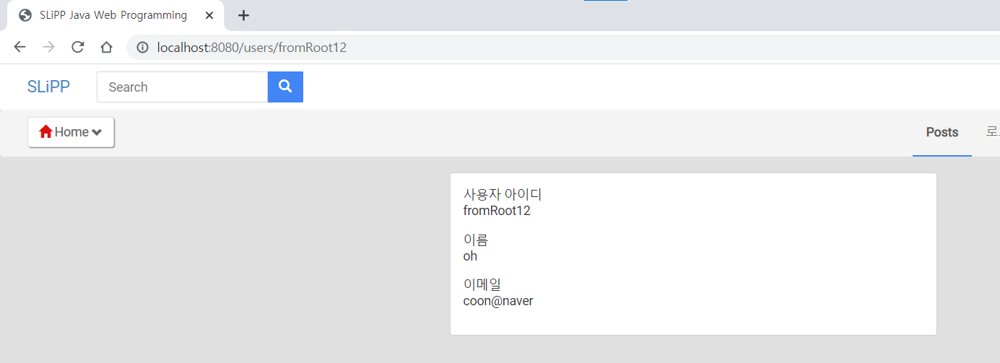

# 8. 회원 목록, 회원 정보 조회 기능 구현

`src/resources/templates/include/navaigation.html`에 회원 목록 링크 추가

* ```html
  <!-- src/resources/templates/include/navaigation.html -->
  <!-- 윗부분 생략 -->
        <div class="collapse navbar-collapse" id="navbar-collapse2">
          <ul class="nav navbar-nav navbar-right">
            <li class="active"><a href="/">Posts</a></li>
            <li><a href="/" role="button">로그인</a></li>
            <li><a href="/users/signUpForm" role="button">회원가입</a></li>
            <li><a href="/" role="button">로그아웃</a></li>
            <li><a href="/" role="button">개인정보수정</a></li>
            <li><a href="/users" role="button">회원목록</a></li>
          </ul>
        </div>
      </div>
    </div>
  </div>
  </html>
  ```

  * `UserController`의 상위 url이 `users`이므로 `/users`로 했다.
  * 수정하면서 아직 구현안된 다른 링크들은 일단 main page로 링크를 걸었다. (error페이지 자꾸 가는게 싫어서)

`/users`를 매핑하는 메서드를 `UserController`에서 생성

* ```java
  // src/main/java/com/app/controller/UserController.java
  @Controller
  @RequestMapping("/users")
  public class UserController {
  
    // 윗부분 생략
    
    @GetMapping("")
    public String list(Model model) {
      model.addAttribute("users", userService.getAllUsers());
      return "users/list";
    }
  }
  ```

  * 데이터 베이스에서 가져온 user list들을 view에 전달하기 위해 `Model` 사용

데이터베이스에 저장된 모든 user들을 가져오는 로직을 처리하기 위해 `UserService`에 메서드 생성

* ```java
  // src/main/java/com/app/service/UserService.java
  @Service
  public class UserService {
    // 생략
  
    public List<User> getAllUsers() {
      return userRepository.findAll();
    }
  }
  ```

  * `findAll()`은 `JpaRepository` interface에 있기 때문에 따로 메서드를 만들 필요없다.

실행 후 `회원목록`을 눌러 확인

* 
  * 당연히 `src/resources/templates/users`에 `list.html`이 없으니 에러가 발생

`list.html`추가

* ```html
  <!DOCTYPE html>
  <html lang="kr" xmlns:th="http://www.thymeleaf.org">
  <head th:replace="include/header :: header"></head>
  <body>
  <div th:replace="include/navigation :: navigation"></div>
  
  <div class="container" id="main">
    <div class="col-md-10 col-md-offset-1">
      <div class="panel panel-default">
        <table class="table table-hover">
          <thead>
          <tr>
            <th>idx</th>
            <th>사용자 아이디</th>
            <th>이름</th>
            <th>이메일</th>
            <th></th>
            <th></th>
          </tr>
          </thead>
          <tbody>
          <tr th:each="user : ${users}">
            <th scope="row" th:text="${user.getId()}"></th>
            <td th:text="${user.getUserId()}"></td>
            <td th:text="${user.getName()}"></td>
            <td th:text="${user.getEmail()}"></td>
            <td><a href="#" class="btn btn-success" role="button">수정</a></td>
          </tr>
          </tbody>
        </table>
      </div>
    </div>
  </div>
  
  <div th:replace="include/footer::footer"></div>
  </body>
  </html>
  ```

  * `UserController`의 `list()`메서드에서 `Model`을 이용해서 사용자 list를 `list.html`에 전달했다. 이 Object를 사용하기 위해 thymeleaf 문법을 사용했다. 
  * `Model`에 담을때 attributeName을 `users`로 지정해줬다. 그리고 `th:each`반복문을 이용해서 user list의 각 user 정보들을 출력했다.
  * `th:each="user : ${users}"`에서 `${users}`는 `Model`에 담긴 Object의 이름이고, `user`는 이 반복문에서 사용할 Object의 이름이다. 그래서 `<tr>`자식 tag들인 `<td>`에서 `${user.getName()}`등으로 사용할 수 있는것.

다시 실행하고 회원가입 후  `회원목록`을 눌러 확인해보면

* 
  * 잘 나온다.

근데 테스트하면서 느낀건데, 계속 서버를 재실행 할때마다 회원 데이터가 다 날아가서 다시 회원가입하고 다시 확인해야한다. 이 과정이 너무 귀찮아서 서버 실행시 자동으로 쿼리를 실행하여 자동으로 회원가입 하도록 만들었다.

`src/resources`에 `data.sql`과 `schema.sql`생성 (파일명을 꼭 이렇게 해야하는것 같다.)

* ```sql
  # src/resources/schema.sql
  CREATE table user (
  	id bigint NOT NULL primary key AUTO_INCREMENT,
  	user_id varchar(15) NOT NULL,
  	password varchar(10) NOT NULL,
  	name varchar(255) NOT NULL,
  	email varchar(255) NOT NULL
  );
  ```

* ```sql
  insert into user (user_id, password, name, email) values ('jinho4744', 'secret', 'leejinho', 'jinho@naver');
  insert into user (user_id, password, name, email) values ('fromRoot12', 'secret2', 'oh', 'coon@naver');
  ```

근데 전에 서버 실행시 table을 자동으로 생성하도록 `application.yml`에 설정했는데, `schema.sql`과 충돌이 발생했다. 그래서 `application.yml`의 설정을 다시 바꿨다.

* ```yaml
  spring:
    jpa:
      hibernate:
        ddl-auto: none
    sql:
      init:
        enabled: false
  ```

  * `ddl-auto`를 `create-drop`에서 `none`로 바꿨고, `sql.init.enabled=false`를 추가해줬다.

그리고 회원 목록에서 `상세` 버튼을 누르면 회원 한명에 대한 정보를 볼 수 있는 페이지를 만들었다. 이 부분은 동영상강의에 없고 그냥 만들어 보고싶어서 만듬.

회원 목록 페이지에서 각 회원들 표(?)에 `상세`버튼을 만든다.

* ```html
  <!-- src/resoucres/templates/users/list.html -->
  <!-- 윗부분 생략 -->
          <tr th:each="user : ${users}">
            <th scope="row" th:text="${user.getId()}"></th>
            <td th:text="${user.getUserId()}"></td>
            <td th:text="${user.getName()}"></td>
            <td th:text="${user.getEmail()}"></td>
            <td><a th:href="@{/users/{userId}(userId=${user.getUserId()})}"  class="btn btn-success" role="button">상세</a></td>
            <td><a href="#" class="btn btn-success" role="button">수정</a></td>
          </tr>
          </tbody>
        </table>
      </div>
    </div>
  </div>
  
  <div th:replace="include/footer::footer"></div>
  </body>
  </html>
  ```

  * thymeleaf 문법을 이용해서 회원 정보 상세 조회 url을 `/users/{userId}`로 했다. 여기서 `{userId}`는 각 회원의 user id이다.
  * `/users/{userId}`까지가 url이고 그 뒤의 `(userId=${user.getUserId()})`는 `userId`에 값을 지정해주는것이다.

url을 지정했으면 당연히 url을 매핑하는 메서드를 `UserController`에서 만들어준다.

* ```java
  // src/main/java/com/app/controller/UserController.java
  @Controller
  @RequestMapping("/users")
  public class UserController {
  
    // 윗부분 생략
  
    @GetMapping("{userId}")
    public String getUser(@PathVariable String userId, Model model) {
      model.addAttribute("user", userService.getUserInfo(userId));
  
      return "users/userInfo";
    }
  }
  ```

  * `@GetMapping("{userId}")`는 `getUser()`메서드의 `@PathVariable`어노테이션을 이용한다는것이다. `@PathVariable`의 이름과 `@GetMapping({})`의 `{}`안의 이름과 같아야한다.

url을 매핑하는 메서드를 만들었으면 역시 또 비즈니스 로직을 담당하는 메서드(`getUserInfo()`)를 `UserService`에 만들어준다.

* ```java
  // src/main/java/com/app/service/UserService.java
  @Service
  public class UserService {
  
    // 윗부분 생략
  
    public User getUserInfo(String userId) {
      return userRepository.findByUserId(userId);
    }
  }
  ```

마찬가지로 `UserRepository`에 `findByUserId() `를 만들어준다.

* ```java
  // src/main/java/com/app/repository/UserRepository.java
  public interface UserRepository extends JpaRepository<User, Long> {
  
    User findByUserId(String userId);
  }
  ```

마지막으로 `src/resources/templates/users/`에 `userInfo.html`을 만든다.

* ```html
  <!-- src/resources/templates/users/userInfo.html -->
  <!DOCTYPE html>
  <html lang="kr" xmlns:th="http://www.thymeleaf.org">
  <head th:replace="include/header :: header">
  </head>
  <body>
  <div th:replace="include/navigation :: navigation"></div>
  <div class="container" id="main">
    <div class="col-md-6 col-md-offset-3">
      <div class="panel panel-default content-main" th:object="${user}">
          <div class="form-group">
            <div>사용자 아이디</div>
            <div th:text="*{userId}"></div>
          </div>
          <div class="form-group">
            <div>이름</div>
            <div th:text="*{name}"></div>
          </div>
          <div class="form-group">
            <div>이메일</div>
            <div th:text="*{email}"></div>
          </div>
          <div class="clearfix"/>
      </div>
    </div>
  </div>
  
  <div th:replace="include/footer :: footer"></div>
  </body>
  </html>
  ```

  * 강의에는 없는 부분이라 따로 template이 없다. 그래서 나도 대충만듬..

* 

  * url을 보면 `users/jinho4744`이다. url이 아이디에 따라 달라진다.

* 

회원 목록 페이지에는 사용자 아이디, 이름만 출력하고 상세 버튼을 누르면 전화번호, 주소, 이메일, 자기소개 등을 출력하도록 하면 괜찮을거 같기도..?


