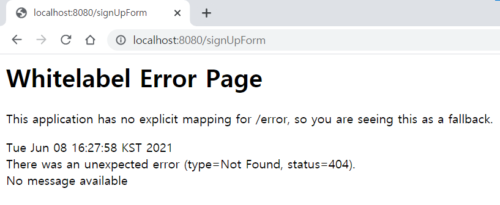

## 4. static & templates, Controller, Thymeleaf

spring boot에서 프로젝트를 생성하면 기본적으로 `src/main/resources`에 두개의 directory가 있다. `static`과 `templates`

* `static` css나 js등 정적 컨텐츠를 담는다.
* `templates`에는 thymeleaf관련 컨텐츠를 담는다.
* [공식 문서 참고](http://docs.spring.io/spring-boot/docs/current/reference/html/boot-features-developing-web-applications.html#boot-features-spring-mvc-static-content)

`static ` directory 기본 설정에서 url이 없으면 index.html으로 인식한다. 그래서 `localhost:8080`이나 `localhost:8080/index.html`둘 다 같은 page를 반환한다.

* 
* 
  * 둘 다 같은 page임!


정적 페이지가 아닌 동적 페이지를 출력하기 위해서는 `templates`에서 작성해야한다. 그리고 spring boot에서 `templates`에 있는 html파일을 출력하기 위해 Controller가 필요하다.

* ```java
  // HomeController
  
  @Controller
  public class HomeController {
    
    public String home() {
      return "index";
    }
  }
  ```

* ```html
  <!-- src/resources/templates/index.html -->
  <!DOCTYPE html>
  <html lang="en">
  <head>
    <meta charset="UTF-8">
    <title>Main Page</title>
  </head>
  <body>
  <h1> I'm in templates!!</h1>
  </body>
  </html>
  ```

* 

사용자(browser)에서 요청한 주소 (`localhost:8080/{url}`) 👉 Spring Boot의 Controller에서 `{url}`에 매핑되는 메서드를 찾는다. 👉 메서드에서 반환하는 String이 `templates`에 있는 html파일명 👉 해당 파일을 사용자가 볼 수 있게 전달한다.

* ```java
  // HomeController
  @Controller
  public class HomeController {
  
    @GetMapping("/home")
    public String home() {
      return "index";
    }
  }
  ```

  

* 

  * `localhost:8080/home`의 `home`에 매핑되는 메서드 `String home()` 👉 `home()`이 반환하는 `index`를 `src/resources/templates`에서 찾아 사용자에게 보여준다.

`static`과 `templates`차이를 하나 더 보면 `static`의 경우 url에 `.html`까지 붙여야하지만 `templates`은 기본적으로 html에 매핑되기때문에 붙이지않는다.


# 5 회원 가입 페이지 만들기

view 처리를 하는 방법을 알아보고 내가 아는 수준에서는

1. MVC패턴으로 back end와 front end를 같이 처리
2. REST API를 통해 사용자로부터의 요청을 server에서 처리 후 client로 JSON형태로 보냄, client에서 JSON을 이용해서 View 처리 후 사용자에게 보여줌

이정도이다. 후자의 방법 중 요즘은 React를 많이 쓴다고 한다. 우선은 1번 방법으로 공부 한 후에 2번방법도 시도해볼것.


메인 페이지에 Navigation을 깔고, Navigation에 회원가입 링크를 만들어 회원 가입 form 페이지로 이동할 것이다. 그래서 먼저 main 페이지를 수정했다.

- ```html
  <!-- resources/templates/index.html -->
  <!doctype html>
  <html lang="en">
  <head>
    <meta charset="utf-8">
    <meta name="viewport" content="width=device-width, initial-scale=1">
    <link href="https://cdn.jsdelivr.net/npm/bootstrap@5.0.1/dist/css/bootstrap.min.css"
          rel="stylesheet"
          integrity="sha384-+0n0xVW2eSR5OomGNYDnhzAbDsOXxcvSN1TPprVMTNDbiYZCxYbOOl7+AMvyTG2x"
          crossorigin="anonymous">
    <title>Sliip</title>
  </head>
  <body>
  <nav class="navbar navbar-expand-lg navbar-light bg-light">
    <div class="container-fluid">
      <a class="navbar-brand" href="">Sliip</a>
      <button class="navbar-toggler" type="button" data-bs-toggle="collapse"
              data-bs-target="#navbarSupportedContent" aria-controls="navbarSupportedContent"
              aria-expanded="false" aria-label="Toggle navigation">
        <span class="navbar-toggler-icon"></span>
      </button>
      <div class="collapse navbar-collapse" id="navbarSupportedContent">
        <ul class="navbar-nav me-auto mb-2 mb-lg-0">
          <li class="nav-item">
            <!-- 회원가입 페이지 링크 추가-->
            <a class="nav-link" href="/signUpForm">회원가입</a>
          </li>
          <li class="nav-item">
            <a class="nav-link" href="">Link</a>
          </li>
        </ul>
      </div>
    </div>
  </nav>
  <h1>This is main Page!</h1>
  <script src="https://cdn.jsdelivr.net/npm/bootstrap@5.0.1/dist/js/bootstrap.bundle.min.js"
          integrity="sha384-gtEjrD/SeCtmISkJkNUaaKMoLD0//ElJ19smozuHV6z3Iehds+3Ulb9Bn9Plx0x4"
          crossorigin="anonymous"></script>
  </body>
  </html>
  ```

- 
  - Navbar 등은 bootstrap을 참고했다.

메인 페이지의 Navigation에서 `회원가입`을 누르면 회원 가입 페이지로 이동하도록 했다. 그러기 위해서 index.html에서 a 태그를 통해 `/signUpForm`을 요청한다. 그러나 Controller에 해당 url을 매핑해줄 메서드가 존재하지 않기 때문에 누르면 오류 페이지로 이동한다.

* 
  * url을 보면 `localhost:8080/signUpForm`은 잘 나왔지만 매핑되는 페이지가 없어 에러페이지가 출력됨

이제 `/signUpForm`을 매핑해주는 메서드를 Controller에서 생성한다.

* ```java
  // HomeController
  @Controller
  public class HomeController {
  
    @GetMapping("/signUpForm")
    public String signUpForm() {
      return "signUpForm";
    }
  }
  ```

* ```html
  <!-- resources/templates/signUpForm.html -->
  <!doctype html>
  <html lang="en">
  <head>
    <meta charset="utf-8">
    <meta name="viewport" content="width=device-width, initial-scale=1">
    <link href="https://cdn.jsdelivr.net/npm/bootstrap@5.0.1/dist/css/bootstrap.min.css"
          rel="stylesheet"
          integrity="sha384-+0n0xVW2eSR5OomGNYDnhzAbDsOXxcvSN1TPprVMTNDbiYZCxYbOOl7+AMvyTG2x"
          crossorigin="anonymous">
    <title>Sliip</title>
  </head>
  <body>
  <nav class="navbar navbar-expand-lg navbar-light bg-light">
    <div class="container-fluid">
      <a class="navbar-brand" href="">Sliip</a>
      <button class="navbar-toggler" type="button" data-bs-toggle="collapse"
              data-bs-target="#navbarSupportedContent" aria-controls="navbarSupportedContent"
              aria-expanded="false" aria-label="Toggle navigation">
        <span class="navbar-toggler-icon"></span>
      </button>
      <div class="collapse navbar-collapse" id="navbarSupportedContent">
        <ul class="navbar-nav me-auto mb-2 mb-lg-0">
          <li class="nav-item">
            <a class="nav-link" href="/signUpForm">회원가입</a>
          </li>
          <li class="nav-item">
            <a class="nav-link" href="">Link</a>
          </li>
        </ul>
      </div>
    </div>
  </nav>
  <h1>회원 가입 페이지</h1>
  <div class="container">
    <form method="post" action="/createUser">
      <div class="mb-3">
        <label for="sign-up-form-userId" class="form-label">사용자 아이디</label>
        <input type="text" class="form-control" id="sign-up-form-userId" name="userId">
      </div>
      <div class="mb-3">
        <label for="sign-up-form-password" class="form-label">Password</label>
        <input type="password" class="form-control" id="sign-up-form-password" name="password">
      </div>
      <div class="mb-3">
        <label for="sign-up-form-name" class="form-label">이름</label>
        <input type="password" class="form-control" id="sign-up-form-name" name="name">
      </div>
      <div class="mb-3">
        <label for="sign-up-form-email" class="form-label">이메일</label>
        <input type="password" class="form-control" id="sign-up-form-email" name="email">
      </div>
      <button type="submit" class="btn btn-primary">Submit</button>
    </form>
    <script src="https://cdn.jsdelivr.net/npm/bootstrap@5.0.1/dist/js/bootstrap.bundle.min.js"
            integrity="sha384-gtEjrD/SeCtmISkJkNUaaKMoLD0//ElJ19smozuHV6z3Iehds+3Ulb9Bn9Plx0x4"
            crossorigin="anonymous"></script>
  </div>
  </body>
  </html>
  ```

  * 이때 Controller의 매핑되는 메서드의 return String이 resources/templates에 있는 html파일 이름과 같아야하고, `@GetMapping`어노테이션의 value와 요청하는 url과 같아야한다. 

페이지를 만들 때는 `resoures/templates`에 html파일을 만들고 Controller 클래스에서 매핑해주는 메서드를 만들어 주면 된다.

그러면 회원 가입 기능을 만드려면 어떻게 해야할까?

# 6. 회원 가입 기능 추가

`signUpForm.html`에서 form 태그를 이용하여 input들을 받았었다. input에 정보를 입력하고 제출 버튼을 누르면 form 태그의 `action` attribute를 통해 url로 전송할 수 있다.

* 

  ```html
  <!-- resources/templates/signUpForm.html -->
  <!-- 윗부분 생략-->
  <h1>회원 가입 페이지</h1>
  <div class="container">
    <form action="/create">
      <div class="mb-3">
        <label for="sign-up-form-userId" class="form-label">사용자 아이디</label>
        <input type="text" class="form-control" id="sign-up-form-userId" name="userId">
      </div>
      <div class="mb-3">
        <label for="sign-up-form-password" class="form-label">Password</label>
        <input type="password" class="form-control" id="sign-up-form-password" name="password">
      </div>
      <div class="mb-3">
        <label for="sign-up-form-name" class="form-label">이름</label>
        <input type="password" class="form-control" id="sign-up-form-name" name="name">
      </div>
      <div class="mb-3">
        <label for="sign-up-form-email" class="form-label">이메일</label>
        <input type="password" class="form-control" id="sign-up-form-email" name="email">
      </div>
      <button type="submit" class="btn btn-primary">Submit</button>
    </form>
  <!-- 아래쪽 생략 -->
  ```

  * form 태그 안에 input 태그가 있다. input에 해당하는 데이터들을 입력하고 submit 버튼을 누르면 `localhost:8080/create` url로 해당 데이터를 전달한다.

url을 매핑하는 메서드를 Controller에서 만들고, 그 메서드 안에서 전달받은 데이터들을 출력해보자.

* ```java
  // HomeController.java
  @Controller
  public class HomeController {
    // 위쪽 생략
    
    @GetMapping("/create")
    public String printUserData(String userId, String password, String name, String email) {
      System.out.println(userId);
      System.out.println(password);
      System.out.println(name);
      System.out.println(email);
      return "index";
    }
  }
  ```

* 

* 

  * 참고로 url (`localhost:8080/create`)로 전달되는 input 태그들의 이름은 name attribute에 의해 결정된다. url과 매핑되는 메서드의 인자들 이름과 name 값과 같아야 전달 받은 데이터를 처리할 수 있다.
  * 예) name 값이 userId인데 String temp이면 안된다는 뜻.

데이터(이름, 아이디, 패스워드 등)은 전달이 됐는데 String으로 하나씩 관리하지 않고 User라는 Object를 만들어 관리하자.

* ```java
  // User.java
  @Data
  public class User {
  
    private String userId;
    private String password;
    private String name;
    private String email;
  }
  ```

회원 가입을 하면 회원 정보를 계속 가지고 있어야 로그인도 하고, 로그인 이후에 회원 정보 수정 등을 할 수 있다. 입력한 데이터를 저장하기 위해 데이터베이스에 저장을 해야한다.

1. User 데이터를 가공하고 처리하는(business logic) 클래스인 UserService 클래스를 생성한다.

   * ```java
     // UserService.java
     @Service
     public class UserService {
     
       @Autowired
       private UserRepository userRepository;
     
       public void create(User newUser) {
         userRepository.save(newUser);
       }
     }
     ```

     * 보통 UserService를 interface로 만들고 구현부인 UserServiceImpl를 새로 만들어서 처리한다고 하는데 간단한 서비스 구현이므로 불필요 하다고 판단하여 class로 만들어 사용

2. UserService 클래스에서 JPA를 이용하여 미리 연결해놓은 mysql에 user를 저장한다.

   1. JPA를 사용하기위해 UserRepository 인터페이스를 생성한다.

      * ```java
        // UserRepository.java
        import org.springframework.data.repository.CrudRepository;
        
        public interface UserRepository extends CrudRepository<User, Long> {
        
        }
        ```

        * CrudRepository의 crud만 사용할것이기 때문에 따로 메서드는 만들지 않는다.

   2. User를 데이터베이스에 저장하기위해 User 클래스를 조금 수정한다.

      * ```java
        // User.java
        @Data
        @Entity
        public class User {
        
          @Id
          @GeneratedValue
          private Long id;
        
          @Column(nullable = false, length = 15)
          private String userId;
          @Column(nullable = false, length = 10)
          private String password;
          @Column(nullable = false)
          private String name;
          private String email;
        }
        
        ```

        * PrimaryKey를 위해 id가 필요하다.
      
   3. 마지막으로 HomeController에서 UserService의 `create()`메서드를 호출한다.
   
      * ```java
        // HomeController
        @Controller
        public class HomeController {
        
          @Autowired
          private UserService userService;
        
        	// 중간 생략
        
          @GetMapping("/create")
          public String create(User user) {
            userService.create(user);
            return "index";
          }
        }
        
        ```

이제 다시 실행 후, 회원가입 페이지에서 정보를 입력하고 제출버튼을 누르면 데이터베이스에 저장이된다. 근데 에러가 발생한다. 왜냐? 미리 연결해놓은 sliip 데이터베이스에 user라는 table이 없기 때문이다. 그러므로 table을 생성한다.

* mysql에서 직접 쿼리를 작성하여 table을 생성

* 혹은 `application.yml`에서 설정

  * ```yaml
    # application.yml
    spring:
    	jpa:
    		hibernate:
    			ddl-auto: create-drop
    ```

    * 어플리케이션을 실행할때마다 table을 삭제하고 다시 생성한다.
  
* 

  * 데이터베이스에 저장된 

이제 진짜_최종, 회원가입 페이지에서 정보를 입력하고 제출버튼을 누르면 데이터베이스에도 저장이 됐다. 근데 또 문제가 있다. 뭐냐고? 제출 버튼을 누르면  HomeController의 `create()`메서드에서 회원정보를 데이터베이스에 저장하고, `index.html`페이지로 가도록 한다.

* 
  * url을 보면 개인정보 노출이된다. 특히 password는 치명적임

위와 같이 url에 key - value 값이 같이 나오는 이유는 GET Method를 이용했기 때문이다. 새로운 리소스를 생성할때는 주로 POST Method를 사용한다.

* GET Method
  * 주로 데이터를 읽거나 검색할 때 사용되며, 요청할때 파라미터는 url을통해 전달된다.
* POST Method
  * 주로 새로운 리소스를 생성할 때 사용되며, 요청할때 전달할 정보들을 Request Body에 담아서 전달한다.

그러므로 `signUpForm.html`의 form 태그의 method attribute를 post로 바꾸고, HomeController의 `create()`메서드를 PostMapping으로 바꾼다.

* 
  * POST Method 사용 후 url


